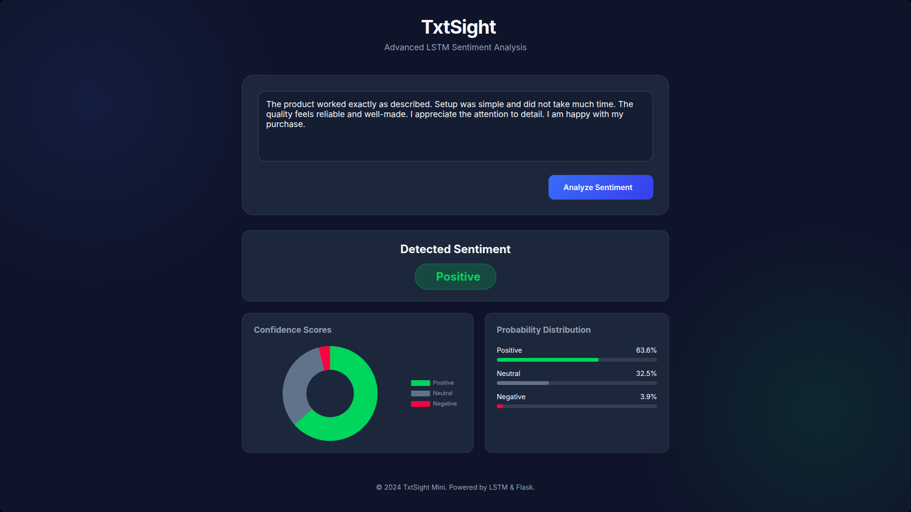

# Text Sentiment Analyzer with LSTM

This project is a web-based application that analyzes the sentiment of user-provided text using a Long Short-Term Memory (LSTM) neural network. It classifies text into **Positive**, **Neutral**, or **Negative** sentiments and provides probability scores for each class.

## Features

- **Deep Learning Model**: Utilizes a pre-trained LSTM model for accurate sentiment classification.
- **Real-time Analysis**: Instant sentiment prediction through a user-friendly web interface.
- **Probability Scores**: Displays the confidence level for each sentiment category.
- **Text Preprocessing**: robust cleaning pipeline including stopword removal, lemmatization, and noise reduction.

## Tech Stack

- **Backend**: Python, Flask
- **Machine Learning**: TensorFlow/Keras, NumPy, Scikit-learn (Joblib)
- **NLP**: NLTK, BeautifulSoup
- **Frontend**: HTML, CSS (in `static` and `templates`)

## Project Structure

```
├── 📂 Models/
│   └── 📄 LSTM_MODEL.pkl       # Pre-trained LSTM model
├── 📂 src/
│   ├── 📄 __init__.py
│   ├── 📄 load_models.py       # Script to load the ML models
│   └── 📄 text_preprocessing.py # Text cleaning and processing functions
├── 📂 static/                  # CSS and other static assets
├── 📂 templates/               # HTML templates
├── 📄 app.py                   # Main Flask application
├── 📄 requirements.txt         # Python dependencies
├── 📄 tokenizer.pkl            # Tokenizer for text vectorization
└── 📄 README.md                # Project documentation
```

## User Interface (Screenshot)



## Installation

1.  **Clone the repository:**
    ```bash
    git clone <repository-url>
    cd Text-Sentiment-Analyzer-With-LSTM
    ```

2.  **Create and activate a virtual environment (optional but recommended):**
    ```bash
    python -m venv venv
    source venv/bin/activate  # On Windows use `venv\Scripts\activate`
    ```

3.  **Install the dependencies:**
    ```bash
    pip install -r requirements.txt
    ```
    *Note: You may need to install NLTK data (stopwords, wordnet) if not already present.*

## Usage

1.  **Run the application:**
    ```bash
    python app.py
    ```

2.  **Access the web interface:**
    Open your web browser and navigate to `http://127.0.0.1:5000/`.

3.  **Analyze Text:**
    - Enter text into the input field.
    - Click the "Predict" button.
    - View the predicted sentiment and probability distribution.

## Docker Usage

### Build and Run with Docker

1.  **Build the Docker image:**
    ```bash
    docker build -t sentiment-analyzer .
    ```

2.  **Run the container:**
    ```bash
    docker run -p 5000:5000 sentiment-analyzer
    ```

3.  **Access the application:**
    Open your browser and navigate to `http://localhost:5000/`

### Using Docker Compose (Optional)

Create a `docker-compose.yml` file:
```yaml
version: '3.8'
services:
  web:
    build: .
    ports:
      - "5000:5000"
    volumes:
      - .:/app
    environment:
      - FLASK_ENV=development
```

Then run:
```bash
docker-compose up
```

## Model Details

The model is built using Keras/TensorFlow and employs an LSTM architecture suitable for sequence processing tasks like sentiment analysis. It uses a `tokenizer.pkl` to convert text into sequences and `LSTM_MODEL.pkl` for inference.